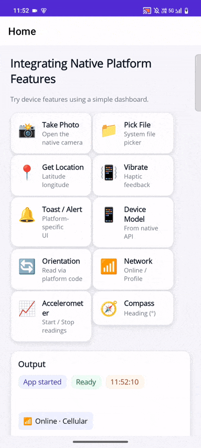

# Integrating-Native-Platform-Features-in-.NET-MAUI

## Overview

This blog shows how to use basic native features in a .NET MAUI app without writing separate code for each platform. It includes small examples for getting the device model, using platform‑specific services, handling permissions, and accessing native APIs through simple interfaces. The goal is to help you understand how to connect shared MAUI code with Android, iOS, Windows, or macOS features in a clear and easy way.

## Understand What’s Built‑In to MAUI

.NET MAUI provides built‑in APIs (via Microsoft.Maui.Essentials) that let you use native device features directly from shared C# code:

* MediaPicker → Camera
* FilePicker → File selection
* Geolocation → Location/GPS
* Connectivity → Internet status
* Accelerometer, Compass → Motion & direction sensors
* Vibration, Haptics → Feedback

No duplicate platform projects or bindings are required.

## Step‑by‑Step Feature Implementations

The blog covers:

* Camera (capture photos)
* File Picker (attach files)
* Location (GPS)
* Connectivity (online/offline handling)
* Sensors (accelerometer & compass)
* Haptics & Toast (feedback system)

## Platform Permissions Explained Clearly

The blog shows all required permissions:

Android Manifest permissions
iOS / macOS Info.plist keys
And when to request permissions at runtime in MAUI

## Best practices

* Keep business logic in shared code; isolate native code in platform folders.
* Use interfaces or partial classes to avoid duplication.
* Prefer built‑in cross‑platform APIs first; add native code only when unavoidable.
* Test on real devices for each platform.
* Handle runtime permissions carefully and verify manifest or plist entries.
* Register handler customizations early in startup.

## Screenshort

## Troubleshooting

| Issue | Action |
| ---------------------------------- | --------------------------------------------------- |
| Build error | Clean and rebuild solution. |
| Permission denied at runtime | Verify manifest or Info.plist entries. |
| Native namespace or type not found | Ensure code is in correct platform folder. |
| Handler customization not applied | Confirm registration order; place before app build. |

### Path Too Long Exception

If you are facing a path too long exception when building this example project, close Visual Studio and rename the repository to short and build the project.

For a step-by-step procedure, refer to the link.

## Conclusion

We hope this guide gave you a clearer picture of how native features can elevate your .NET MAUI applications. With simple APIs you can build apps that feel instantly responsive and naturally integrated with every device they run on. These capabilities help your application behave smarter, react faster, and deliver experiences that truly feel native on Android, iOS, Windows, and macOS.

For current Syncfusion customers, the newest version of Essential Studio is available from the [license and downloads page](https://www.syncfusion.com/Account/Login?ReturnUrl=%2faccount%2fdownloads). If you are not yet a customer, you can try our 30-day free [trial](https://www.syncfusion.com/downloads) to check out these new features. 
 For questions, you can contact us through our support [forums](https://www.syncfusion.com/forums), [feedback portal](https://www.syncfusion.com/feedback), or support [portal](https://support.syncfusion.com/). We are always happy to assist you!

